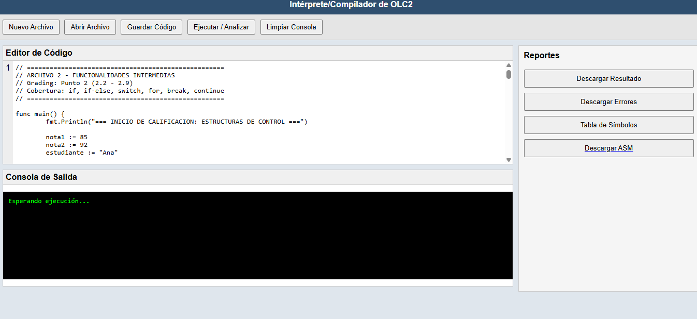

Manual de Usuario - Golampi

Esta es la interfaz:

Descripción
Golampi es un intérprete para un subconjunto del lenguaje Go desarrollado como proyecto académico utilizando ANTLR4 y PHP.

El sistema permite:

editar código en un editor web
analizar sintaxis
analizar semántica
ejecutar el programa
generar reportes de errores
Interfaz del sistema
La interfaz está compuesta por tres áreas principales:

Barra de herramientas
Permite ejecutar acciones sobre el código.

Botones disponibles:

Nuevo: limpia el editor.
Abrir: carga un archivo desde el sistema.
Guardar: guarda el código actual.
Ejecutar: analiza y ejecuta el programa.
Limpiar: limpia el contenido del editor.
Editor de código
Área donde el usuario escribe el programa Golampi.

Características:

numeración de líneas
edición de texto
soporte para múltiples líneas
Consola
La consola muestra:

errores sintácticos
errores semánticos
resultado de ejecución del programa
Funciones del lenguaje
El intérprete soporta las siguientes funciones nativas.

fmt.Println()
Imprime valores en la consola.

Ejemplo: